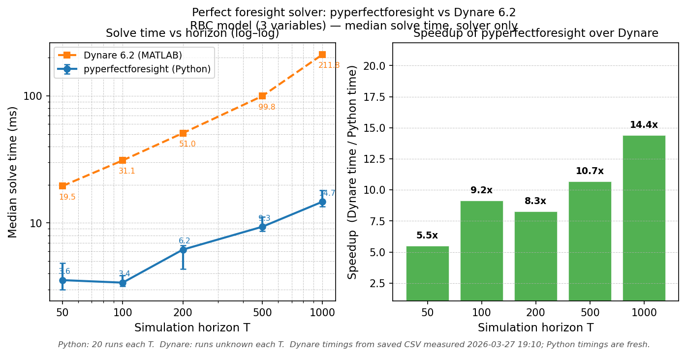

# pyperfectforesight

A minimal Dynare-style perfect foresight solver in Python. This package provides tools for solving dynamic economic models using perfect foresight methods, inspired by [Dynare](https://www.dynare.org/).

**[Documentation](https://shunsuke-hori.github.io/pyperfectforesight/)**

## Why pyperfectforesight?

### vs Dynare

Dynare is the reference platform and pyperfectforesight is validated against it (results agree to ~1e-10 on the same models). The reasons to use this package instead:

- **No MATLAB required.** Dynare requires MATLAB (commercial) or Octave. pyperfectforesight is pure Python — `pip install` and go.
- **Python-native workflow.** Equations are SymPy expressions. Results are NumPy arrays. No `.mod` files, no separate toolchain — the model lives in the same script as the analysis.
- **Programmatic.** Parameter sweeps, Monte Carlo, IRF grids: write a loop. In Dynare you would need to script around MATLAB/Octave.
- **Faster.** pyperfectforesight is ~23–61× faster than Dynare on the same RBC model (see [Performance](#performance) below).

### vs dolo

[dolo](https://github.com/EconForge/dolo) is a Python DSGE toolkit that also has a `deterministic_solve` function. The key difference is timing:

- **dolo has hidden shifts in the exogenous path.** Its internal `_shocks_to_epsilons` function silently drops `shocks[0]` and maps `epsilons[t] = shocks[t+1]`. On top of that, YAML `transition` equations use the *next*-period exogenous value, adding a second shift for state variables. The net result is that the shock you supply at index `t` lands at simulation period `t+1` or `t+2` depending on how the variable is declared — with no warning.
- **pyperfectforesight uses direct timing.** `exog_path[t]` is the exogenous value at period `t`, matching Dynare's convention exactly. Cross-validation between the two solvers is straightforward.
- **Expectation-errors solver.** pyperfectforesight implements `solve_perfect_foresight_expectation_errors`, which replicates Dynare's `perfect_foresight_with_expectation_errors_solver`. dolo has no equivalent.

## Features

- **Object-oriented API**: `Model` class encapsulates `process_model()` output — declare the model once and call `model.solve()`, `model.solve_homotopy()`, `model.solve_expectation_errors()`, and `model.steady_state()` without repeating `model_funcs` or `vars_dyn`
- **Dynare-style lag notation**: Write equations using `v("k", -1)` for lagged variables, matching Dynare's convention
- **Augmented-path BVP solver**: Stock/jump variable models use a boundary-value problem formulation — `initial_state` is the pre-period-0 value `k_{-1}`, and all period-0 variables are solved simultaneously
- **Symbolic equation processing**: Define models using SymPy symbolic math
- **Automatic differentiation**: Compute Jacobian blocks automatically
- **Sparse Newton solver**: Efficient sparse Jacobian and Newton iterations for large-scale models
- **Homotopy continuation**: `solve_perfect_foresight_homotopy` for large shocks that are hard to solve directly
- **Expectation-errors solver**: `solve_perfect_foresight_expectation_errors` replicates Dynare's `perfect_foresight_with_expectation_errors_solver` — agents are surprised at multiple `learnt_in` periods and the full path is stitched from sub-simulations
- **Compiled steady-state solver**: `compile_steady_state_funcs` + `solve_steady_state` compute steady states at any exogenous level; results are returned as a `SteadyState` object that carries the parameter values and exogenous values used, and is transparently usable as a numpy array wherever `endval` or `ss` is expected
- **Automatic terminal steady-state computation**: Pass `compiled_ss` to any solver and omit `endval` — the terminal boundary is automatically computed from `exog_path[-1]`, guaranteeing it is a true steady state consistent with the long-run exogenous level
- **Generic steady-state solver**: Numerical steady-state computation for any model
- **Auxiliary variable support**: Handle auxiliary (non-dynamic) variables via analytical substitution, dynamic augmentation, or nested numerical solving

## Performance

pyperfectforesight is **~23–61× faster** than Dynare 6.2 on the same RBC model, measured on the solver step alone (excludes one-time compilation/setup on both sides).



| Horizon T | Python (ms) | Dynare (ms) | Speedup |
|----------:|------------:|------------:|--------:|
|        50 |        0.86 |       19.55 |  22.7×  |
|       100 |        0.82 |       31.08 |  37.9×  |
|       200 |        1.06 |       50.95 |  48.1×  |
|       500 |        2.10 |       99.75 |  47.4×  |
|      1000 |        3.45 |      211.79 |  61.4×  |

*RBC model, 3 variables, one-time TFP shock. Median of 20 runs each. Solver only.*

To reproduce: install dev extras (`pip install -e ".[dev]"` for matplotlib), then run `python scripts/benchmark.py --dynare --plot` (requires MATLAB + Dynare 6.2). Omit `--dynare` to plot using the saved Dynare CSV already in the repo.

## Installation

### From source (development)

1. Clone or download this repository
2. Install the package in development mode:
   ```bash
   pip install -e ".[dev]"
   ```

### With pip (when published)

```bash
pip install pyperfectforesight
```

## Quick Start

The recommended entry point is the `Model` class. Declare the model once; call `model.solve()` as many times as needed without repeating `model_funcs` or `vars_dyn`.

```python
import numpy as np
from pyperfectforesight import v, Model

# Parameters baked in numerically
ALPHA = 0.36
BETA  = 0.99

# Dynare-style equations:
#   Euler:   1/c_t = beta * alpha * k_t^(alpha-1) / c_{t+1}
#   Capital: k_t   = k_{t-1}^alpha - c_t
#
# k appears at lag -1 in the accumulation equation (Dynare convention).
eq_euler = v("c", 0)**(-1) - BETA * ALPHA * v("k", 0)**(ALPHA-1) * v("c", 1)**(-1)
eq_kacc  = v("k", 0) - v("k", -1)**ALPHA + v("c", 0)

model = Model([eq_euler, eq_kacc], ["c", "k"])

# Steady state
K_SS = (ALPHA * BETA) ** (1 / (1 - ALPHA))
C_SS = K_SS**ALPHA - K_SS
ss = np.array([C_SS, K_SS])

# Transition path: k_{-1} starts 10% above steady state
T = 100
k_neg1 = np.array([K_SS * 1.1])   # initial_state = k_{-1} (Dynare convention)

sol = model.solve(T, {}, ss, initial_state=k_neg1, stock_var_indices=[1])
print(f"Converged: {sol.success}")

X = sol.x.reshape(T, -1)   # shape (T, 2): columns are [c, k]
c_path, k_path = X[:, 0], X[:, 1]
```

### With Exogenous Variables

`z` is the TFP level (steady state `z=1`). `exog_path[t]` is the value of `z` at period `t`.

```python
import numpy as np
from pyperfectforesight import v, p, Model

ALPHA_S = p("alpha")
BETA_S  = p("beta")
PARAMS  = {ALPHA_S: 0.36, BETA_S: 0.99}

# TFP level z multiplies production; steady state z = 1
eq_euler = v("c", 0)**(-1) - BETA_S * ALPHA_S * v("k", 0)**(ALPHA_S-1) * v("c", 1)**(-1)
eq_kacc  = v("k", 0) - v("z", 0) * v("k", -1)**ALPHA_S + v("c", 0)

model = Model([eq_euler, eq_kacc], ["c", "k"],
              vars_exo=["z"], vars_params=["alpha", "beta"])

K_SS = (0.36 * 0.99) ** (1 / (1 - 0.36))
C_SS = K_SS**0.36 - K_SS
ss = np.array([C_SS, K_SS])

T = 100

# AR(1) TFP shock: 1% above SS on impact, mean-reverting to z=1
rho = 0.9
exog = np.ones((T, 1))   # z = 1 at SS
exog[0, 0] = 1.01        # 1% shock at t=0
for t in range(1, T):
    exog[t, 0] = 1 + rho * (exog[t-1, 0] - 1)

sol = model.solve(T, PARAMS, ss,
                  initial_state=np.array([K_SS]),
                  exog_path=exog)
print(f"Converged: {sol.success}")
```

### Permanent Shocks with Auto-computed Terminal Steady State

For permanent shocks the terminal steady state differs from the initial one. `Model.solve()` handles this automatically — `endval` is computed from `exog_path[-1]` using a lazily-built compiled steady-state bundle:

```python
import numpy as np
from pyperfectforesight import p, v, Model

ALPHA_S = p("alpha")
BETA_S  = p("beta")
PARAMS  = {ALPHA_S: 0.36, BETA_S: 0.99}

eq_euler = v("c", 0)**(-1) - BETA_S * ALPHA_S * v("k", 0)**(ALPHA_S-1) * v("c", 1)**(-1)
eq_kacc  = v("k", 0) - v("z", 0) * v("k", -1)**ALPHA_S + v("c", 0)

model = Model([eq_euler, eq_kacc], ["c", "k"],
              vars_exo=["z"], vars_params=["alpha", "beta"])

# Pre-shock steady state at z=1
ss_pre = model.steady_state(PARAMS, exog_ss=np.array([1.0]))

T = 100
exog_path = np.full((T, 1), 1.05)   # permanent TFP increase

# endval is auto-computed from exog_path[-1] (post-shock SS at z=1.05)
sol = model.solve(T, PARAMS, ss_pre,
                  exog_path=exog_path,
                  initial_state=np.array([ss_pre[1]]))
print(f"Converged: {sol.success}")
```

Pass `endval=...` to override the auto-computed terminal steady state, or `compiled_ss=None` to disable auto-computation entirely.

### Homotopy for Large Shocks

When direct Newton fails to converge for large shocks, use homotopy continuation:

```python
# Uses the parameter-free model and ss from the Quick Start section above
k_neg1 = np.array([K_SS * 1.5])   # 50% above steady state

sol = model.solve_homotopy(T, {}, ss,
                           initial_state=k_neg1,
                           stock_var_indices=[1],
                           n_steps=10,
                           verbose=True)
print(f"Converged: {sol.success}")
```

### Multiple Surprise Shocks (Expectation Errors)

Replicates Dynare's `perfect_foresight_with_expectation_errors_solver`. Agents are surprised at each `learnt_in` period and re-solve from that point forward; the full path is stitched from the sub-simulations.

```python
import numpy as np

# Same model, PARAMS, and ss_pre as the "Permanent Shocks" section above.
# Agents initially expect no shock (period 1), then learn of a
# persistent TFP shock at period 3.
T = 100

exog_surprise = np.full((T, 1), 1.05)   # permanent TFP level from period 3 onward

news_shocks = [
    (1, None),             # period 1: baseline, no shock expected
    (3, exog_surprise),    # period 3: agents learn of permanent shock
]

sol = model.solve_expectation_errors(T, PARAMS, ss_pre, news_shocks,
                                     initial_state=np.array([ss_pre[1]]))
print(f"Converged: {sol.success}")
X_full = sol.x.reshape(T, -1)   # (T, n_endo) stitched path
```

Each entry in `news_shocks` is a 2-tuple `(learnt_in, exog_path)` or a 3-tuple `(learnt_in, exog_path, endval)`. The optional `endval` mirrors Dynare's `endval(learnt_in=k)` block for permanent shocks that change the terminal steady state. The list must be sorted by `learnt_in` and the first entry must have `learnt_in=1`.

## Stock/Jump Variable Formulation

The solver always uses an **augmented-path BVP (boundary value problem) formulation**:

- An `initval` boundary row is prepended and an `endval` row (terminal steady state) is appended to form a `T+2`-row augmented path. The `initval` row holds pre-period-0 values for stock variables (from `initial_state`) and steady-state values for jump variables (from `ss_initial`); the `t=-1` entries for jump variables are not economically meaningful since jump variables have no negative-lag appearances by definition.
- Residuals are evaluated at periods `t = 0, …, T-1` using the full augmented path, so all `T×n` unknowns (including period-0 jump variables) are determined simultaneously.
- `initial_state` provides `k_{-1}` — the **pre-period-0** value for each **stock** variable, following Dynare's convention. Period-0 values of all variables (including jump variables like `c`) are solved by the model.
- `stock_var_indices` is inferred automatically from the lead-lag incidence table: variables that appear at any negative lag are classified as stock (predetermined); all others are jump variables free to respond at `t=0`. You can also pass it explicitly to override the inference.

This correctly handles jump variables — pinning `X[0]` directly would over-constrain them and produce a structurally singular Jacobian.

## Examples

See the `examples/` directory for complete examples:

- `rbc_demo.py`: Basic RBC model with capital shock
- `rbc_with_government.py`: RBC model with exogenous government spending shocks
- `rbc_with_investment.py`: RBC model with auxiliary variables (investment ratio)
- `rbc_taxes.py`: RBC model with labor, government spending, and AR(1) TFP (dolo replication)
- `gali_2015_zlb.py`: Optimal monetary policy at the ZLB (Gali 2015, Ch. 5.4.2)

Run the examples:
```bash
python examples/rbc_demo.py
python examples/rbc_taxes.py
python examples/gali_2015_zlb.py
```

Legacy versions using the functional API directly are preserved as `*_legacy.py` in the same directory.

## Package Structure

```
pyperfectforesight/
├── __init__.py       # Package exports
├── __version__.py    # Version information
└── core.py          # Core functionality
```

### Main API

**Object-oriented (recommended):**

- **`Model(equations, vars_dyn, vars_exo=None, vars_params=None, ...)`**: Declare the model once; exposes `steady_state()`, `solve()`, `solve_homotopy()`, and `solve_expectation_errors()` as methods. Attributes: `vars_dyn`, `vars_exo`, `vars_params`, `vars_aux`, `aux_method`.

**Functional API:**

- **`v(name, lag)`**: Create a time-indexed symbolic variable (e.g. `v("k", -1)` for `k_{t-1}`)
- **`p(name)`**: Create a parameter symbol
- **`process_model(equations, vars_dyn, ...)`**: Process and compile model equations
- **`compile_steady_state_funcs(equations, vars_dyn, vars_exo=None)`**: Compile steady-state residual functions once; exogenous variables are treated as free parameters so the steady state can be computed at any exogenous level
- **`solve_steady_state(compiled_ss, params_dict, exog_ss=None)`**: Solve for the steady state using pre-compiled functions; returns a `SteadyState` object carrying the values, parameter dict, and exogenous values used
- **`SteadyState`**: Steady-state solution with full provenance (values, params, exog_ss, variable names); transparently usable as a numpy array
- **`compute_steady_state_numerical(equations, vars_dyn, params_dict, ...)`**: Compute steady state numerically (no pre-compilation)
- **`solve_perfect_foresight(T, params_dict, ss, model_funcs, vars_dyn, ...)`**: Solve perfect foresight transition path
- **`solve_perfect_foresight_homotopy(T, params_dict, ss, model_funcs, vars_dyn, ...)`**: Homotopy continuation for difficult shocks
- **`solve_perfect_foresight_expectation_errors(T, params_dict, ss, model_funcs, vars_dyn, news_shocks, ...)`**: Multiple surprise (MIT) shocks — replicates Dynare's expectation-errors solver

### Low-level Functions

For advanced users who want more control:

- `lead_lag_incidence()`: Detect variable lead/lag structure in equations
- `is_static()`, `eliminate_static()`: Handle static equations
- `local_blocks()`: Compute Jacobian blocks
- `residual()`, `sparse_jacobian()`: Build residuals and Jacobians

## Configuration Options

### `Model` / `process_model()` options:
- `vars_exo=None`: List of exogenous variable names
- `vars_params=None`: List of parameter names
- `vars_aux=None`: List of auxiliary (non-dynamic) variable names
- `aux_method='auto'`: How to handle auxiliary variables: `'auto'`, `'analytical'`, `'dynamic'`, `'nested'`
- `eliminate_static_vars=True/False`: Eliminate static variables before solving

### `model.solve()` / `solve_perfect_foresight()` options:
- `X0=None`: Initial guess for the `T × n` path. If omitted, defaults to the terminal steady state (`endval` if provided, otherwise `ss`) tiled over all `T` periods.
- `exog_path=None`: Exogenous variable path (`T × n_exo` array)
- `initial_state=None`: Pre-period-0 values of stock variables (`k_{-1}` in Dynare convention); defaults to `ss_initial[stock_var_indices]` (economy starts at steady state)
- `stock_var_indices=None`: Column indices (into `vars_dyn`) of stock (predetermined) variables; inferred from the lead-lag incidence table when not provided
- `ss_initial=None`: Initial steady-state values used for the `initval` boundary row; defaults to `ss`
- `endval=None`: Override the terminal steady state (right BVP boundary). If `None` and `compiled_ss` is provided and `exog_path` is not `None`, automatically computed from `exog_path[-1]`. Otherwise defaults to `ss`.
- `compiled_ss=None`: Pre-compiled steady-state bundle; enables automatic `endval` computation from the terminal exogenous level. (`Model` manages this automatically; pass `compiled_ss=None` to opt out.)
- `solver_options=None`: Sparse Newton solver options (supports `maxiter`, `ftol`, `xtol`, `maxfev`)

### `model.solve_homotopy()` / `solve_perfect_foresight_homotopy()` additional options:
- `n_steps=10`: Number of homotopy steps (must be a positive integer)
- `exog_ss=None`: Baseline exogenous path at `λ=0`; defaults to zero
- `verbose=False`: Print progress at each homotopy step

### `model.solve_expectation_errors()` / `solve_perfect_foresight_expectation_errors()` options:
- `news_shocks`: List of 2-tuples `(learnt_in, exog_path)` or 3-tuples `(learnt_in, exog_path, endval)`. Must be sorted by `learnt_in`; first entry must have `learnt_in=1`. Each `exog_path` is the belief path **indexed from period `learnt_in`**: row 0 = period `learnt_in`, row 1 = period `learnt_in+1`, etc. `exog_path=None` passes an all-zero path.
- `constant_simulation_length=False`: If `False` (Dynare default), each sub-solve uses the shrinking horizon `T - learnt_in + 1`. If `True`, every sub-solve runs for the full `T` periods.
- `sub_x0=None`: Per-sub-solve initial guesses (list of arrays or `None` entries).

## Requirements

- Python >= 3.9
- NumPy >= 1.20.0
- SciPy >= 1.7.0
- SymPy >= 1.9.0
- Matplotlib >= 3.3.0 (for examples)

## Development

To contribute or modify:

1. Clone the repository
2. Install in development mode with dev dependencies:
   ```bash
   pip install -e ".[dev]"
   ```
3. Run tests (all test files are in `tests/`):
   ```bash
   pytest
   ```

## License

MIT License

## Acknowledgments

Inspired by [Dynare](https://www.dynare.org/), the reference platform for solving dynamic economic models.

## Citation

If you use this package in your research, please cite:

```bibtex
@software{pyperfectforesight,
  title={pyperfectforesight: A Minimal Dynare-style Perfect Foresight Solver in Python},
  author={Shunsuke Hori},
  year={2026},
  url={https://github.com/Shunsuke-Hori/pyperfectforesight}
}
```
